# VOGUE: A Multimodal Conversational Fashion Recommendation Dataset

The **VOGUE dataset** (Visual-recommendation dialOgue with Grounded User Evaluations) is designed for benchmarking
conversational recommendation systems (CRS). It captures realistic fashion shopping scenarios through 60 human–human 
dialogues between a Seeker and an Assistant. Each dialogue is grounded in a fixed item catalog with both product 
images and metadata.

## Key Features
- 60 multi-turn dialogues (~900 turns, ~2,100 utterances, ~22k tokens)
- Role-specific utterance-level tags for Seeker and Assistant
- Item catalogs of 12 fashion products per conversation (images + metadata)
- Participant profiles collected via pre-task surveys (~40 extra items rated per participant)
- Dual post-conversation ratings: Seeker (ground-truth preferences) and Assistant (predicted scores)
- Seeker satisfaction surveys (Likert-scale) after each conversation

## Dataset Statistics
| **Statistic**                      | **Count** |
|------------------------------------|-----------|
| Conversations                      | 60        |
| Participants                       | 20        |
| **Total turns**                    | 899       |
| **Total utterances**               | 2,100     |
| **Total tokens**                   | 22,717    |
| **Average turns per conversation** | 14.8      |
| **Average tokens per turn**         | 36.1      |

## Directory Structure

.  
├── LICENSE.txt               # licensing information  
├── README.md                 # this file  
├── vogue_loader.py           # helper loader class for dataset access  
├── conversation_trials/      # main dialogue trial data  
│   ├── item_ratings/         # per-conversation item ratings  
│   ├── transcripts/          # 60 dialogue JSON transcripts  
│   └── scenarios.json        # list of scenarios used  
├── fashion_profiles/         # participant-level profiles (profiles.csv, ratings.csv)  
├── metadata/                 # per-item metadata JSON and product images (items 1–76)  
├── supplements/              # auxiliary files (e.g., catalogue mappings, stage analysis visuals)  
└── surveys/                  # original survey text files (profile_survey.txt, item_rating_survey.txt)  


## Data Schema

### Fashion Profiles (`fashion_profiles/profiles.csv` + `fashion_profiles/ratings.csv`)  
One row per participant (`participant_id`).  

#### **`profiles.csv`**  
Contains survey-based metadata for each participant.  

Columns*:  
- `participant_id`: unique user ID (e.g., `"a1"`, `"s4"`)  
- `style_preferences`: free-text style description  
- `style_vibes`: multi-label categorical description (self-reported vibes/tags)  
- `comfort`, `style`, `practicality`, `trends`, `brand`, `self_expression`, `sustainability`, `price`, `color_importance`: numeric Likert-scale ratings (`1` Least – `5` Most)  
- `importance_vec`: vectorized form of the above ratings (length 9)  
- `purchase_frequency`: categorical or free-text (`Weekly`, `Biweekly`, `Monthly`, `Quarterly`, `Yearly`, `Other`)  
- `monthly_spend`: clothing spend in CAD (`< $50`, `$50–$100`, …, `> $500`, or `Other`)  
- `best_colors`: free-text preferred colors  
- `clothing_feel`: free-text description of clothing feel/identity  

*See `surveys/survey_questions.txt` for exact question wording in `profiles.csv`. 

#### **`ratings.csv`**  
Contains structured ratings for 40 catalogue items per participant.  

Columns:  
- `participant_id`: unique user ID (consistent with `profiles.csv`)  
- `item_37` … `item_76`: numeric ratings of each item (`1`–`5`), `-1` if not rated  
- Duplicate columns (e.g., `item_38_duplicate`) are preserved as in the raw collection process. These were collected to assess if responders were consistent in rating.
- `40_rating_vec`: vector of all item ratings (length 40, `-1` for missing)   

---

### Metadata (`metadata/item_X.json` + `item_X.png`)
Each JSON file describes an item; each PNG is the corresponding image.

Items 1-36 are part of the trial catalogues and comprise both PNG and JSON metadata.

Items 37-76 are part of the 40-item fashion profile survey in PNG format, and do not include metadata at this point in time. 

For completeness, catalogue category mapping is in `supplements/catalogue_mapping.csv`

The catalogue features 3 categories:

`catalogue: 'a'` - Outerwear
`catalogue: 'b'` - Layering Pieces
`catalogue: 'c'` - Shoes

**Filename convention:**  
`item_<id>.json` or `item_<id>.png`

**Fields:**
- `id`: numeric item ID  
- `catalogue`: catalogue letter
- `categories`: hierarchical product categories  
- `product_name`: product title  
- `product_brand`: brand string  
- `product_rating`: average star rating (string, e.g., `"4.4"`)  
- `product_description`: optional text description (nullable)  
- `about_product`: bullet list of features  
- `product_detail`: dictionary of attributes (e.g., `Fabric type`, `Care instructions`)  
- `reviews`: summary of user reviews  
- `image`: separate `.png` file with same ID

**Example Meta Data**

**Item Image**: 

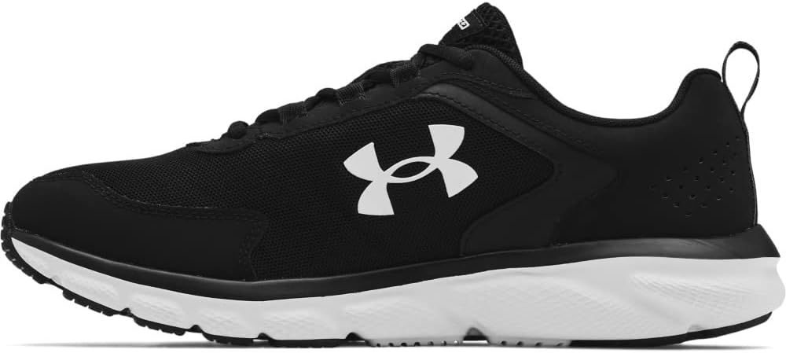

**Item Description (In JSON)**:
```json
{
  "id": 26,
  "catalogue": "c",
  "categories": [
    "Clothing, Shoes & Accessories",
    "Men",
    "Shoes",
    "Fashion Sneakers"
  ],
  "product_name": "Under Armour Mens Charged Assert 9 Running Shoes Running Shoe",
  "product_brand": "Visit the Under Armour Store",
  "product_rating": "4.5",
  "product_description": [
    "Built for speed and comfort",
    "Responsive Charged Cushioning midsole",
    "Solid rubber outsole for durability",
    "Key words: running, performance, support, lightweight"
  ],
  "about_product": [
    "Lightweight mesh upper for breathability",
    "Durable leather overlays for stability",
    "EVA sockliner for comfort",
    "Charged Cushioning for responsiveness",
    "Key words: running shoes, breathable, comfortable, durable"
  ],
  "product_detail": {
    "Care instructions": "Machine Wash",
    "Sole material": "Rubber",
    "Shaft height": "Low-top",
    "Outer material": "Mesh"
  },
  "reviews": "Overall, customers express high satisfaction with the shoes, highlighting their comfort, support, and durability for various activities. Many appreciate the lightweight design and breathability, making them suitable for both running and everyday wear. Some users noted sizing issues but still found the shoes to be a great choice for their needs."
}
```
Note: Due to the large number of reviews, which Assistants could not feasibly parse, we instead include a GPT-4o-mini summary of the reviews. The prompt used to generate the reviews can be found at `supplements/meta_data_summary_prompt.txt`.

---
### Scenarios (`conversation_trials/scenarios.json`)
A JSON list of the scenarios with corresponding scenario number.

### Conversations (`conversation_trials/transcripts/conversations/*.json`)
Each file contains one dialogue between a Seeker and an Assistant.


**Filename convention:**  
`c<conversation_id>_<catalogue>_<scenario>.json`

**Top-level fields:**
- `conversation_id`: numeric ID for the dialogue  
- `scenario`: integer scenario identifier (`1–6`)  
- `catalogue`: catalogue identifier (`a`, `b`, `c`)
  - `'a'` - Outerwear
`'b'` - Layering Pieces
`'c'` - Shoes
- `mentioned_items`: list of item IDs mentioned in the dialogue  
- `gt_items`: list of ground-truth chosen item IDs  
- `conversation_content`: list of turns  

**Each turn contains:**
- `turn`: integer turn index  
- `timestamp`: dialogue time offset as string (`hh:mm:ss`)  
- `content`:  
  - `role`: `'Seeker'` or `'Assistant'`  
  - `utterances`: list of one or more utterance strings  
  - `tags`: list of dialogue intent tags aligned to each utterance

Note: The prompt used to annotate the conversation can be found at `supplements/Tagging_Prompt.txt`.

### Seeker Ratings (`conversation_trials/item_ratings/seeker_ratings.csv`)
Ground-truth ratings from Seekers for catalog items.

Columns:
- `role`: always `"Seeker"`  
- `participant_id`: Seeker ID  
- `conversation_id`: ID linking to dialogue  
- `catalogue`: catalogue letter (`a`, `b`, `c`)  
- `scenario`: scenario number  
- `item_1` ... `item_36`: numeric ratings, `-1` if unrated  
- `rating_vec`: vector of item ratings  
- `likert_1` ... `likert_5`: post-conversation satisfaction ratings**  

**See `surveys/item_rating_questions.txt` for exact question wording.

### Assistant Ratings (`conversation_trials/item_ratings/assistant_ratings.csv`)
Predicted ratings produced by Assistants for catalog items.

Columns:
- `role`: always `"Assistant"`  
- `participant_id`: Assistant ID  
- `conversation_id`: ID linking to dialogue  
- `catalogue`: catalogue letter (`a`, `b`, `c`)  
- `scenario`: scenario number  
- `item_1` ... `item_36`: predicted numeric ratings, `-1` if not assigned  
- `rating_vec`: vector of predicted ratings  
- `assistant_interpretation`: free-text description of the Seeker's scenario  

---
### Platform UI (`supplements/platform_UI/`)
We also present samples of the UI used during the trials below. Both views are presented. In the trials, each participant only saw their respective UI. While the Seeker did not need to scroll to see every item, due to more product info on the Assistant side, they needed to scroll. Between conversations and participants, item locations were randomized to mitigate locational bias.

Seeker UI:

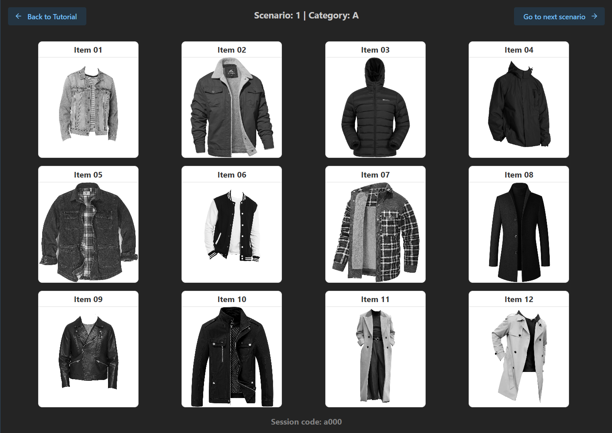

Assistant UI:

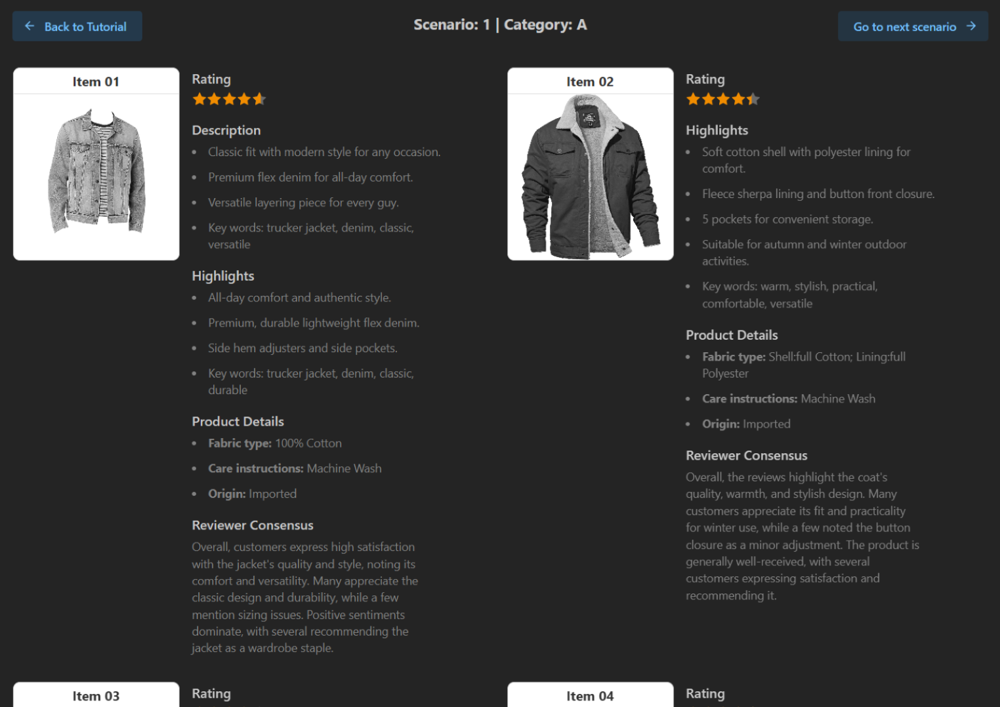


---
### Surveys (`surveys/`)

This folder contains the original survey question text used in data collection.  
It ensures that researchers can reconstruct or adapt the questionnaires if needed.  

- **`item_rating_survey.txt`** — Post-conversation Seeker survey, including the 5 Likert-scale satisfaction questions.  
- **`profile_survey.txt`** — Pre-task participant profile survey, covering demographics, style preferences, and 40 additional item ratings.  

These files preserve the exact wording as presented to participants.

## Minimum Item Mentions

During the data collection process, we instruct Assistants to discuss at least 3 items during each conversation. We observed that this does not meaningfully affect the structure of dialogue, or number of items mentioned. See image below, where first item mention histograms are collated by participant role. Cumulative totals are also presented. We note the distinct lack of plateau around 2 mentioned items, and that the final total mentions do not cluster around 3. This reinforces observations that the first recommendation cluster features 2-4 items, while the second is supplementary as needed. The mode of Assistant first-mentioned items is 4 items.

**Cumulative distribution of first item mentions over the course of the conversation by role**:

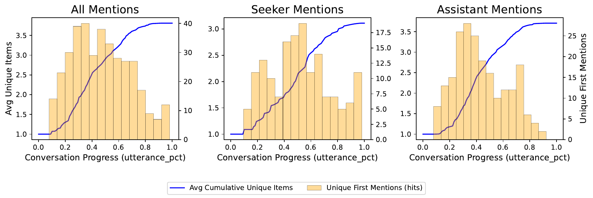

## In-depth Stage Analysis

With the stage analysis in place, we provide a closer account of how conversations narrow from broad exploration to final choice. Stage-wise histograms and  Sankey diagrams of tag transitions are shown below. Although Seekers could reject all options, this never occurred in practice.

**Stage 1: Preference Elicitation**

Conversations begin asymmetrically, with Assistants using Request tags to probe context, and
Seekers responding with Provide to supply details and constraints. This establishes the initial search space, positioning the Assistant as interviewer and the Seeker as explainer.

**Stage 2: Recommendation**

Assistants expand the space by introducing small groups of items with Recommend–Show, often
supported by Explain. Both parties also leverage the shared catalogue to prompt grouped, comparative reasoning: Seekers weigh abstract properties against one another rather than evaluating items in isolation. The dialogue thus broadens quickly while setting up efficient downstream pruning.

**Stage 3: Critique**

Initiative shifts as Seekers employ Critique and Inquire moves, while Assistants counter with Explain and Answer. The search space narrows through this back-and-forth: Seekers articulate trade-offs, and Assistants refine understanding by clarifying features. Dialogue becomes more balanced and collaborative, with preferences expressed at an abstract, attribute-level rather than tied to single items.

**Stage 4: Refinement**

Building on this feedback, Assistants reintroduce a reduced set of candidates with Recommend, often paired with Explain or Personal Opinion. This reduced set may include new introductions, or simply re-affirm a previous recommendation. Item group discussion may continue, as Seekers contribute short Inquire or Rating turns that either reinforce or challenge convergence. This iterative narrowing prunes the options towards a final candidate.

**Stage 5: Final Agreement**

The dialogue closes as Recommendation Rating–Accept peaks: Seekers confirm a choice, often adding a brief Explain for justification. Assistants reciprocate with Explain, Personal Opinion, or Acknowledge, reinforcing closure. At this stage, both roles have actively narrowed the path from broad exploration to final commitment, completing the collaborative arc.

**Stage-wise Sankey diagrams of dialogue act transitions**:

| 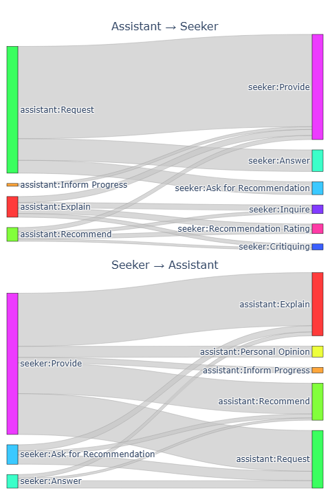 | 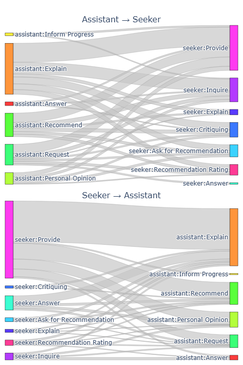 | 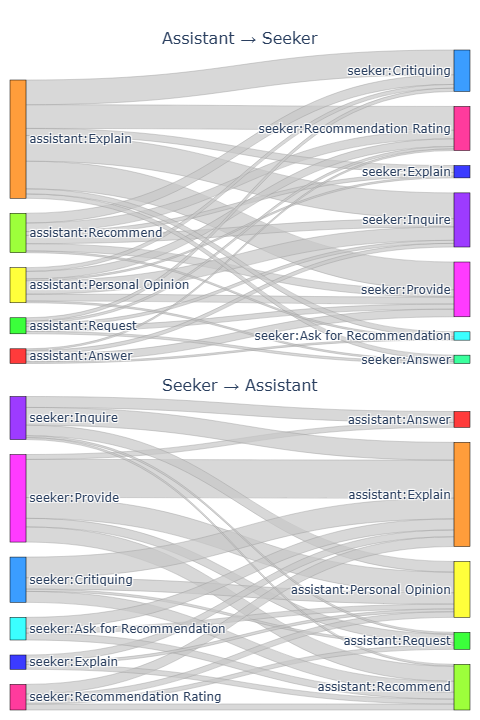 | 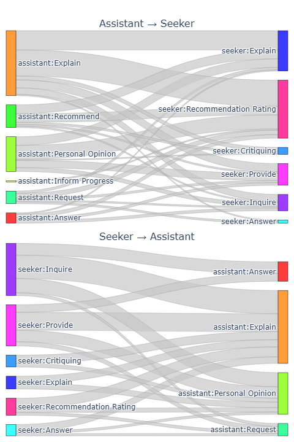 | 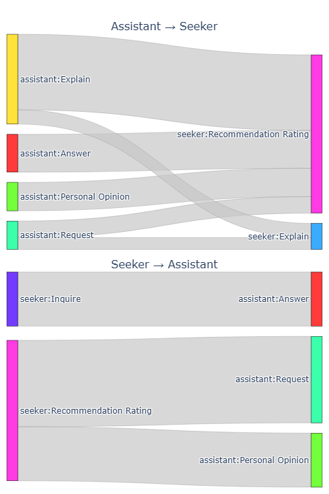 |
|---|---|---|---|---|
| Stage 1 | Stage 2 | Stage 3 | Stage 4 | Stage 5 |

**Stage-wise histograms of dialogue act distributions.**:
| 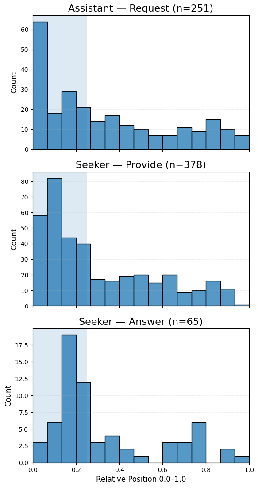 | 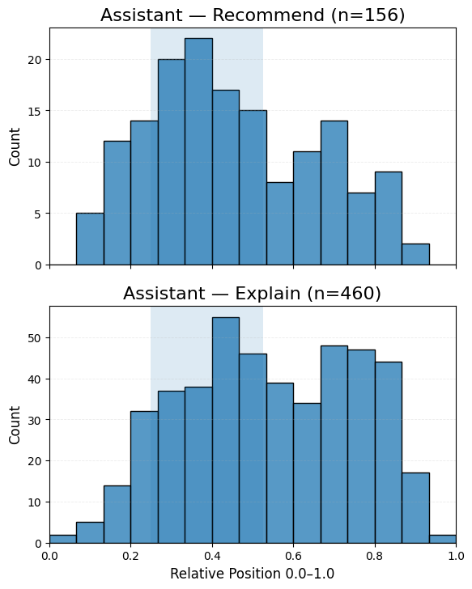 | 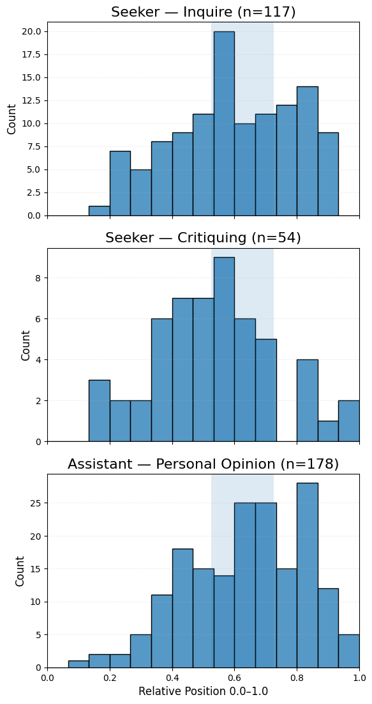 | 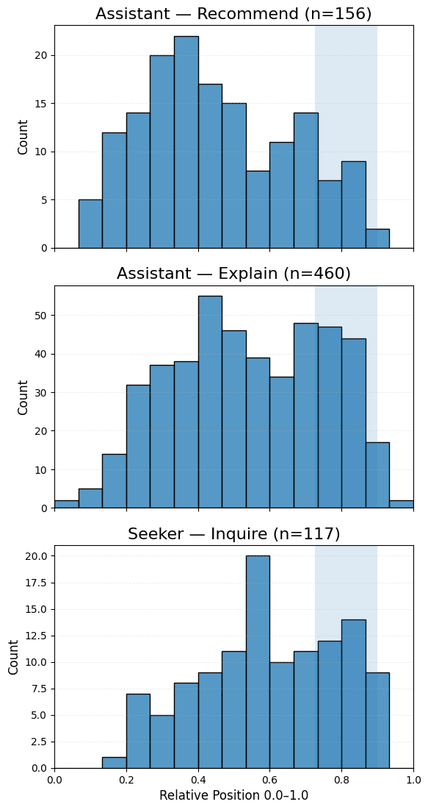 | 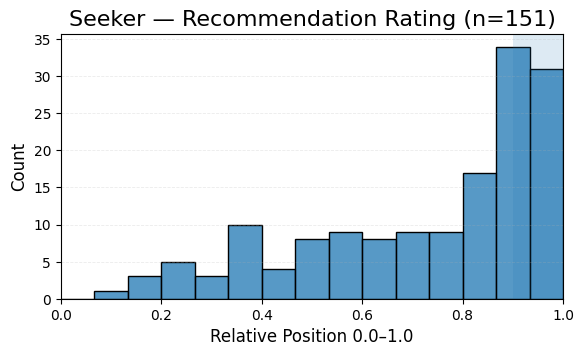 |
|---|---|---|---|---|
| Stage 1 | Stage 2 | Stage 3 | Stage 4 | Stage 5 |


## Usage Example

You can use the provided `VogueDataset` loader to easily access conversations, 
profiles, ratings, and item metadata.

```python
from vogue_loader import VogueDataset

# Initialize dataset (assuming repo cloned with `data/` folder)
vogue = VogueDataset("data")

# --- Conversations ---
conv_list = vogue.list_conversations()
print("Available conversations:", conv_list[:5])

convo = vogue.get_conversation(1)
print("Conversation 1 has", len(convo["conversation_content"]), "turns")

# --- Metadata ---
item = vogue.load_item(1)
print("Example item:", item["product_name"], "-", item["product_brand"])

# --- Ratings ---
seekers = vogue.get_seeker_ratings()
print("Seeker ratings shape:", seekers.shape)

assistants = vogue.get_assistant_ratings()
print("Assistant ratings shape:", assistants.shape)

# --- Profiles ---
profiles = vogue.get_profiles()
print("Profiles head:")
print(profiles.head())
```

## License
- Dialogue transcripts, ratings, and annotations are licensed under **CC-BY 4.0**.  
- Product images and metadata are provided under non-commercial, research-only use.  

See `LICENSE.txt` for details.
